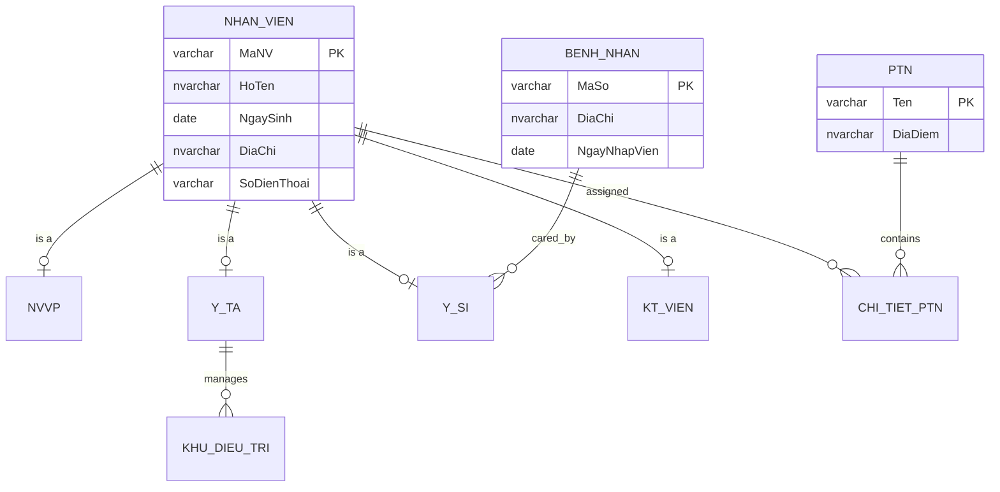
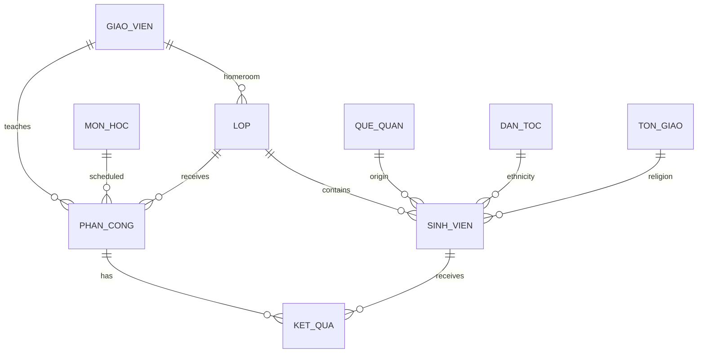

# ERD & Relational Modeling

This document turns the diagrams and relationship exercises from the old coursework into auditable GitHub-native Mermaid diagrams.

## 1. Hospital domain

### Modeling note

The subtype tables use the employee primary key as both **PK and FK** back to `Nhan_Vien`. This is the relational pattern for a supertype/subtype structure. Whether the subtypes are disjoint or overlapping is a business rule and must be stated separately.

## 2. Academic/BTL domain

`KetQua(MaPhanCong, MaSinhVien, LanThi)` uses a composite primary key because one student can take the same assigned course more than once.

## 3. ERD → relational mapping rules used in P007–P010

| Relationship | Relational mapping |
|---|---|
| 1:1 | Place one side's PK as a `UNIQUE` FK on the other side; choose side based on optionality/ownership. |
| N:1 | Put the 1-side PK as an FK on the N-side. |
| N:N | Create a junction relation with both PKs as FKs; usually their combination is the junction PK. |
| Supertype/subtype | Subtype PK is also an FK to the supertype PK. |

A strong answer does not treat cardinality alone as enough for every 1:1 case: total/partial participation and nullability decide the best FK placement.
